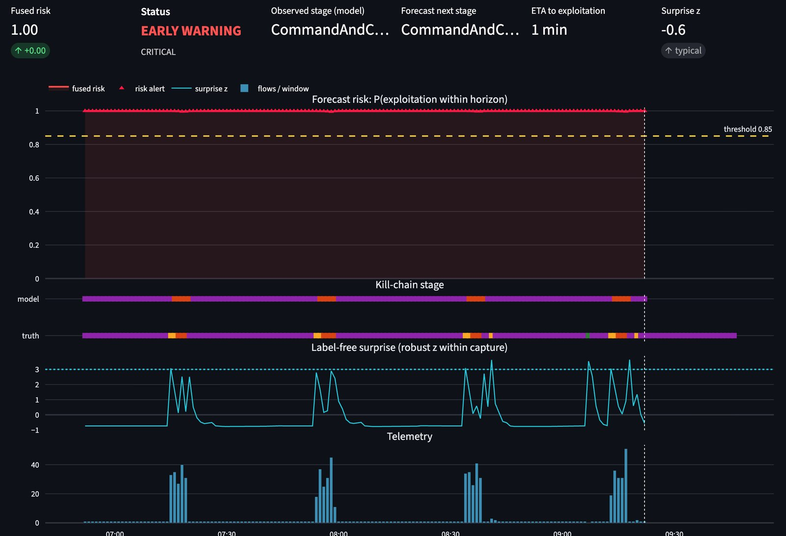
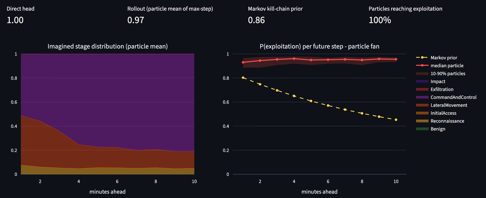
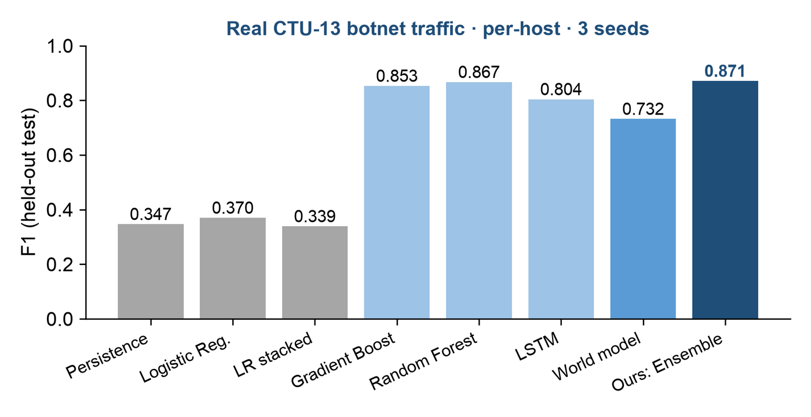

# ThreatAhead: forecasting network attacks before they happen

**Team CtrlXploit** · Smart India Hackathon 2026 · Problem Statement **26153** (NTRO): *AI based Network Attack Forecasting
from Network Traffic Data* · Theme: Blockchain & Cybersecurity

Most security tools **detect** an attack once it is already running. **ThreatAhead forecasts it.** For every computer on
the network it reads the last 24 minutes of traffic and imagines the next 10 minutes 32 times, using a learned **world
model** of how network behaviour evolves, P(S<sub>t+1</sub> | S<sub>t</sub>). It then reports:

- the **probability** that an attack stage starts in the next 10 minutes;
- **which MITRE ATT&CK stage** is coming;
- **roughly when** (an ETA in minutes);
- **why**: the past minutes and the traffic features behind the warning.

A second, **label-free "surprise" signal** flags behaviour the model did not expect, even for malware it has never seen.
Everything runs **offline on a normal laptop CPU**.


*Real infected host from the held-out CTU-13 test data. The model's stage strip matches the true kill chain
(C2 → Reconnaissance → Lateral Movement → C2) four times over, and every pre-attack minute was warned.*

---

## ▶ Run the prototype (about 5–10 minutes the first time)

**You need:** Python **3.10 or newer** ([python.org](https://www.python.org/downloads/); on Windows tick *"Add Python to
PATH"*) and internet **once**, to install packages and download the data. After that it runs fully offline.

### macOS / Linux
```bash
git clone https://github.com/Copernicium282/CtrlXploit.git
cd CtrlXploit
make setup        # 1. creates .venv and installs everything              (first time, ~3-8 min)
make fetch-data   # 2. downloads the processed real datasets, ~250 MB      (first time, ~25 s)
make app          # 3. opens the dashboard at http://localhost:8501
```

### Windows (PowerShell)
```powershell
git clone https://github.com/Copernicium282/CtrlXploit.git
cd CtrlXploit
.\make.ps1 setup
.\make.ps1 fetch-data
.\make.ps1 app
```
If PowerShell says scripts are disabled, run `Set-ExecutionPolicy -Scope Process Bypass` first.

**Next time:** just `make app` (Windows: `.\make.ps1 app`). **Stop:** press `Ctrl+C` in the terminal.

> **Skipped `fetch-data`?** The dashboard still opens, in *demo mode* on the bundled sample files, and shows the one
> command to run. No crash.

---

## 🧭 A 3-minute tour of the dashboard

The dashboard opens on **Model: CTU-13 · real botnet traffic · per-host** and **Telemetry source: Held-out test split**,
which is real traffic the model never saw during training.

1. **Pick a strong example:** in **Host-slot**, choose `8 · 147.32.84.165 · 2011-08-17 06:52 · infected`, then drag
   **Replay position** to the right. Everything right of the cursor is the future the model has not seen.
2. **LIVE MONITOR:** the red line is the forecast risk and the yellow line is the alert threshold. The shading is the
   truth (amber = attack coming within 10 min, red = attack under way). The two colour strips compare the true and
   predicted MITRE stage; the blue line is the label-free surprise. At the top, **Current stage (model estimate)** is
   what the host is doing *now* (detection), while **10-min forecast status** (EARLY WARNING / NORMAL) and **Predicted
   next stage (next 10 min)** are about *where it is heading* (forecasting). So "Current stage: Impact" with
   "forecast status: NORMAL" means *attacking now, but no new escalation expected above the threshold*.
3. **HOST TRIAGE:** every machine ranked by two independent signals: supervised **risk** and label-free **anomaly**.
4. **FORWARD SIM:** the 32 imagined futures for the next 10 minutes, with a table comparing them to what really happened.
5. **MITRE ATT&CK** and **EXPLAIN:** the attack stage now vs forecast; which past minutes (attention) and which features
   (GradientSHAP) drove the warning.
6. **BENCHMARK:** every method compared, with error bars over 3 training runs and the automatic integrity checks.


*At 07:54 (Reconnaissance) the imagined futures put ~45% on Lateral Movement within 1–3 minutes. It began 2 minutes later.*

---

## 📂 Test it on your own traffic

**Sidebar → Telemetry source → Upload file**:
- **PCAP / PCAPNG** (Wireshark, tcpdump);
- **flow CSVs**: CIC-IDS2017/2018 (CICFlowMeter), CTU-13 `.binetflow`, UNSW-NB15, NetFlow/IPFIX exports;
- **Parquet**.

| Requirement | Why |
|---|---|
| A **timestamp** column (required) | forecasting needs time order |
| **Source IP** addresses | needed for per-computer results. Files without IPs: choose the *CSE-CIC-IDS2018 · network-wide* model |
| At least ~10 minutes of activity per host | shorter hosts are skipped |
| Under 2 GB per upload | Streamlit upload limit (`.streamlit/config.toml`) |
| A `Label` column (optional) | if present, the dashboard also shows the truth and the hit/miss scores |

Hosts are the source IPs in private ranges (`10.x`, `192.168.x`, `172.16–31.x`) plus the prefixes in `config.yaml`
(`host_prefixes`). A different network than the training data lowers accuracy (domain shift); the host ranking is
usually the most useful output there.

---

## 📊 Results (measured on held-out data)

All methods use identical features, labels, splits and threshold rule (best F1 with ≤5% false alarms on validation,
frozen before test). Deep models: mean ± std over 3 training runs. Full tables: `reports/<dataset>/<protocol>/evaluation.md`.

**CTU-13, real botnet traffic, per host, time-ordered split** (82,117 test host-minutes; 0.44% precede an attack)

| Method | F1 | Precision | Recall | PR-AUC |
|---|---|---|---|---|
| Persistence ("the future = now", true labels) | 0.347 | 0.213 | 0.937 | 0.199 |
| Logistic regression (the PS baseline) | 0.370 | 0.235 | 0.871 | 0.193 |
| Gradient boosting, 8-min history | 0.853 | 0.946 | 0.777 | 0.851 |
| Random forest, 8-min history | 0.867 | 0.945 | 0.802 | **0.861** |
| LSTM classifier (no world model) | 0.804 ± 0.030 | 0.784 | 0.828 | 0.837 |
| ThreatAhead world model (fused) | 0.732 ± 0.075 | 0.670 | 0.825 | 0.815 |
| **ThreatAhead ensemble (world model + forest, weights from validation)** | **0.871 ± 0.002** | **0.951** | 0.803 | 0.860 |



**Forecasting the next MITRE ATT&CK stage** (macro-F1, infected hosts)

| Minutes ahead | +1 | +2 | +5 | +10 |
|---|---|---|---|---|
| ThreatAhead world model | 0.818 | **0.763** | 0.648 | 0.669 |
| Persistence (knows the true current stage) | **0.832** | 0.755 | 0.632 | 0.581 |
| Per-horizon classifier, 8-min history | 0.789 | 0.759 | **0.760** | **0.695** |

**What this shows, honestly:**
- **Yes/no risk:** tree models with history are the strongest single models on real traffic. The world model alone
  is weaker (0.732), so the deployed risk score is the **ensemble**: the best overall F1 (0.871), right 95% of the time
  when it alerts, with false alerts on 0.02% of normal minutes.
- **Stage forecasting:** the world model beats persistence 10 minutes ahead (0.669 vs 0.581) and is the best
  non-oracle method at +2 minutes; a per-horizon classifier is better at +5 to +10 minutes.
- **Malware families never seen in training** (CTU-13 scenarios 5, 8, 13): every supervised method collapses (PR-AUC
  ≤ 0.16, ours included), but the **label-free surprise channel still separates infected hosts (host AUC 0.853)**.
- **CSE-CIC-IDS2018** (network-wide, no IPs): the world model has the best F1 (0.493 ± 0.054) but the confidence
  intervals overlap, and time of day alone explains ~40% of the signal (flagged by our checks).
- **Integrity checks, all passed on CTU-13:** no train/test overlap, time-of-day leak 0.7%, permutation test
  p < 0.005, a proof that the forecast never uses future data, 0% false alerts on a 5× benign traffic surge.

---

## ⚙️ How it works

```
traffic (PCAP / flows) ─► per-host 1-minute state cells: 31 behaviour features × 3 time scales = 93 numbers
                        ─► encoder → LSTM → causal Transformer   (attention: which past minutes mattered)
                        ─► recurrent state-space world model: memory h + uncertain belief z
                              prior  p(z|h)   = learned dynamics P(S_t+1 | S_t)   (guess before seeing a minute)
                              posterior q(z|h,x)                               (correction after seeing it)
                        ─► imagine 32 futures × 10 minutes, with no future data
                        ─► risk (direct + imagination + kill-chain prior, + tree ensemble) · MITRE stage · ETA
                        ─► surprise = prediction error (label-free) · GradientSHAP explanations · SOC dashboard
```
Details: [docs/architecture.md](docs/architecture.md) · full guide and all results: [docs/README.md](docs/README.md).

---

## 📦 What is in the repo and what is downloaded

| Where | What | Size |
|---|---|---|
| This repo | code, **trained models** (`models/`, 4 models × 3 runs), all **reports** (`reports/`, `eval/results/`), **sample files** (`data/sample/`) | ~115 MB |
| Downloaded by `make fetch-data` | processed datasets (`data/processed/`) from the public Hugging Face dataset [ir192m2Cn282/ThreatAhead](https://huggingface.co/datasets/ir192m2Cn282/ThreatAhead) | ~250 MB |

The sample files (`data/sample/`) are small **synthetic** demo files in three formats (CIC CSV, CTU-13 binetflow,
PCAP). They show that upload and parsing work. They are not the real evaluation data.

**Datasets:** CTU-13 (García et al., Computers & Security 2014; CTU University, CC BY 2.0) and CSE-CIC-IDS2018
(Canadian Institute for Cybersecurity), used under their published terms.

---

## 🔁 Reproduce or retrain from scratch

```bash
make data        # rebuild datasets from the public sources: streams CTU-13 (1.9 GB) + CIC-IDS2018 (9 days), ~0.3 GB kept
make train       # 3 training runs per dataset + all baselines (~2.5 h on a laptop CPU)
make evaluate    # writes reports/<dataset>/<protocol>/evaluation.md
make test        # 39 automated tests (run `make fetch-data` first: some tests use the real data)
```
Windows: `.\make.ps1 data`, `.\make.ps1 train` and so on.

> **Note on the feature set:** the shipped models and the Hugging Face data use the original 31 behaviour features.
> The current code adds 8 packet-level features (payload size, fragmentation, sequential-scan detection). The
> dashboard and uploads work with the shipped models, but **retraining needs `make data` first**, because the fetched
> data does not contain the new columns. Retrained models will give slightly different numbers from the table above.

---

## 🛠 Troubleshooting

| Problem | Fix |
|---|---|
| `make: command not found` (macOS) | run `xcode-select --install` once |
| `make` on Windows | use `.\make.ps1 <target>` instead |
| `python` not found (Windows) | reinstall Python with *"Add Python to PATH"* ticked, or use `py` |
| `No module named sih_v2` | re-run `make setup` in this folder (the package is installed per checkout) |
| Port 8501 busy | `.venv/bin/python -m streamlit run app.py --server.port 8502` |
| First page load is slow | normal: it loads the test data once, then it's fast |

---

**Credits:** the world-model design follows PlaNet/Dreamer (Hafner et al.) and World Models (Ha & Schmidhuber);
ideas adapted from public SIH-26153 prototypes are listed in [docs/provenance.md](docs/provenance.md) (no code reused).
